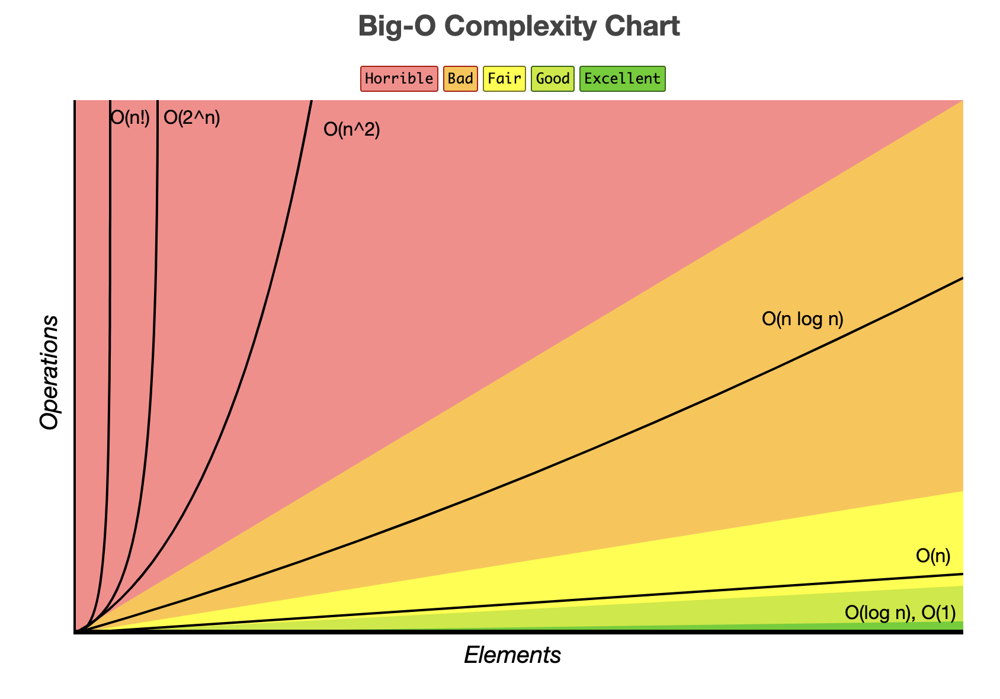
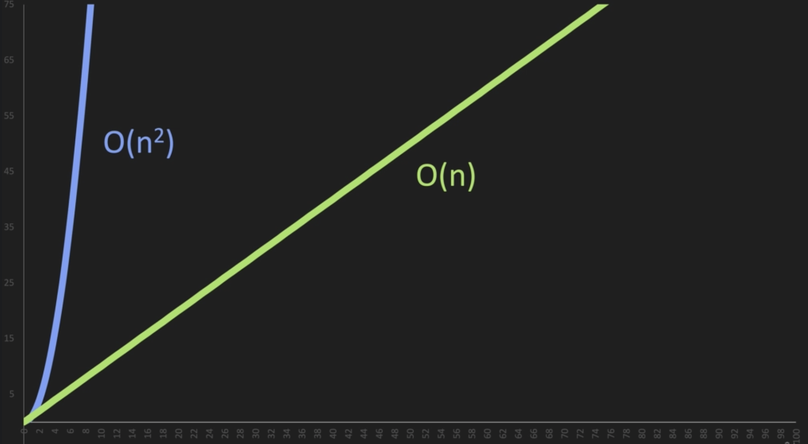

# DATA STRUCTURES AND ALGORITHMS

## Big O


   Best Case - $\Omega $
   Average Case - $\theta$
   Worst Case - $O$(Omnicron)

<!-- $$ Log(O(n))$$ -->
First Big O Notation Example

$O(n)$(Fair - Good complexity)
```js
// Javascript
function logItems(n) {
    for(let i = 0; i < n; i++) {
        console.log(i)
    }
}

logItems(10)
```
-> Run time is independent of the input size of the problem.

-> In the example above we pass the fuction a number(n), and we are iterating n times

-> The number of operations will be porportional to n - means that the growth rate is linear — as n increases, the processing time increases at the same rate.
 
.png)

**Note**: Drop constants 
```js
// Javascript
function logItems(n) {
    for(let i = 0; i < n; i++) {
        console.log(i)
    }
    for(let j = 0; j < n; i++) {
        console.log(j)
    }
}

logItems(10)
```
-> The problem requires a small amount of processing time for each element in the input. Linear.

-> Our code ran n+n times or 2n

-> However, with constants we can drop them $O(2n)$ -> $O(n)$

$O(n^2)$(Horrible complexity)
```js
// Javascript
function logItems(n) {
    for(let i = 0; i < n; i++) {
        for(let j = 0; j < n; i++) {
            console.log(j)
        }
    }
}

logItems(10)
```
-> The problem process all the pairs of the element. Quadratic.

-> Our code runs n*n or $n^2$

-> if our code runs n * n * n or anything over $n^2$ we can just simplify this to $n^2$ for worst case scenario


$O(1)$(Best - often refferd to as constant time)
```js
// Javascript
function addItems(n) {
    return n+n
}

addItems(10)
```
-> As n increases the number of operations will still be the same

-> Often reffered to as constant time

.png)

$O($log n$)$(Execellent - Good)

-> you can see O(log(n)) in binary search, balanced binary search trees, many resursive algoritmhs, priority queues.

-> O(log n) algorithms never look at all the elements in the input. 

-> logarithmic time complexities usually apply to algorithms that eliminate large amounts of input elements in each step.
## Linked lists 

